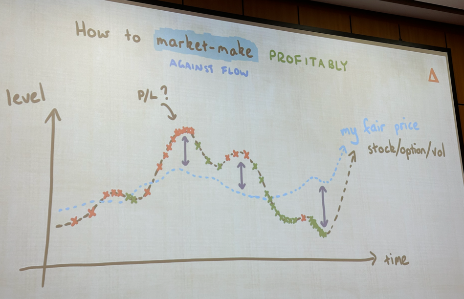

## Readme

### Optiver Notes
##### Market making and volatility trading

- Puzzle
  - Consider an equilateral triangle inscribed in a circle inscribed in an equilateral triangle
  - Area_outer_triangle = 1 unit^2
  - Area_inner_triangle = 1/4 unit^2
  - Symmetry 
- What is market making?
  - Providing liquidity 
  - Help market function

- Derivative 
  - list of prices
  - buyers n sellers put in prices
  - illiquid market
    - **wide** bid-ask spread
    - buyer have to lift the offer
    - sellers have to hit the bid
    - trade list: very volatile (price moving a lot in a short amt of time)
  - fix:
    - put in prices to buy and sell at better levels
    - **narrower** bid-ask spread
    - market becomes more liquid

- A lot of buyers and sellers makes it liquid
- Smaller stocks may have illiquid market 
  - cost execution amt
  - cost of trading may not be worth it
  - optiver makes profit by doing this
    - In order to market make properly, we need to be able to price the instrument we are trading
    - Primary risk
  
- optiver is a dutch company meaning option trader
  - excelled at market making at options derivatives
  - options gives protection against certain scenerios -> delta hedging

- volatility is a measure of how much the stock moves up each day
    - calculate volatility measure
    - look at the deviations compared to the previous points
    - log returns -> why log? -> so you can sum them later
    - std dev -> realised volatility 
    - also should be normalised/annualised or $\sqrt(252)$ for daily volatility
- Options trading -> no perfect way to do it
    - historic volatility -> use this to predict future volatility
        - put into BSM model to price the option

- Puzzle 2:
  - 2 pieces of rope: light one end takes one hour to burn, how to measure 45 mins

- How to predict volatility?
  - Fancy models
  - Simplest one works very well?
  - Power of other models being able to beat the basic one
  - GARCH model
    - Generalised AutoRegressive Conditional Heteroskedasticity
  - MGARCH CCGARCH, HAR, SV, etc -> average of all the model
  - a lot of data are easy to get hold of
  - ML -> XGBoost (decision tree) -> distributed gradient boosting
  - NN MLP
  - RNN LSTM

- try: [www.kaggle.com/c/optiver-realized-volatility-prediction]()

- If we are pricing an option, providing a 2 way
  - What if everyone is a buyer?
  
- Why people don't do it themselves?
  - When there are more buyers than sellers
  - Market makers need to do their jobs better
    - Retreat Scheme
      - price backoff -> change bid/sell price
    - Correlation
      - Lots of things trading in the market are correlated with each other
      - eg. can also buy in another market
  - Predict the fair price
    - Need to hold some amount of risk
  - market-make against flow
    - things can trade against the fair price
    - especially in less efficient market
    - 

- Market making options
  - For a single stock, there can be 1000s of different options
  - Call option should be positively correlated to another call option
    - reduces risk
    - Closer time to expiry and strike price should be more correlated
    - they can be pair traded (nearly identical for longer TTE)

- Does optiver trade in crypto now?
  - very minimal, trade etfs and listed derivative, not active in the stock market
  - timing to participate is uncertain
- Predicting, execution:
  - trader vs researcher role
  - differs from firm to firm
  - optiver do have researchers, focus on ML techniques/other ways to predict volatility
  - traders -> very broad -> who can cover different strengths/roles that could be covered in other 